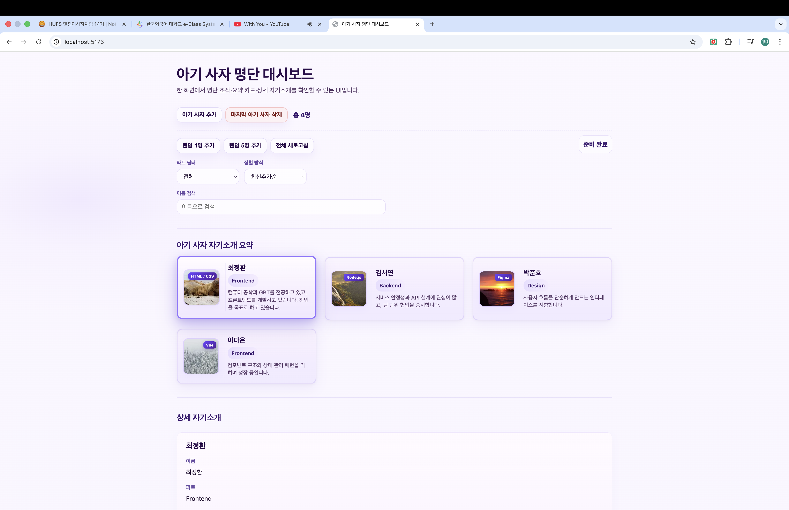
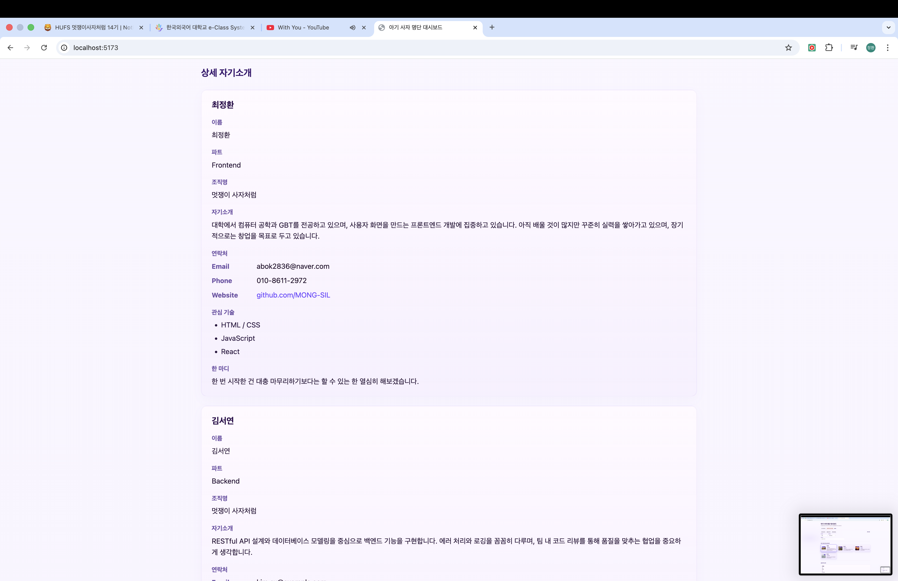

# 📘 Today I Learned

### 1. 오늘 배운 내용

1. 오늘 배운 내용

* Vite + React로 한 화면 앱 만들기
    yarn install 하고 yarn dev로 개발 서버 띄우는 방법을 익혔다.
    http://localhost:5173에서 바로 결과를 확인할 수 있었고, index.html의 #root에 main.jsx → App.jsx가 연결되는 구조도 이해했다.
* React가 화면을 만드는 방식
    React는 함수 컴포넌트에서 JSX로 화면 구조를 작성하면, 바뀐 부분만 실제 DOM에 반영해 준다는 걸 배웠다.
    그래서 코드 구조랑 화면 구조가 거의 비슷하게 보여서 수정할 때 훨씬 편했다.
* 컴포넌트 단위로 화면 분리
    대시보드를 역할별로 나눠서 만들었다.
    헤더, 옵션 영역, 요약 카드, 상세 목록처럼 기능 기준으로 분리하니까 파일별 역할이 명확했고 재사용하기도 편했다.
    특히 카드 컴포넌트는 한 사람 데이터 기준으로 1:1 대응되게 구성했다.
* mock 데이터 관리
    실제 API 대신 src/data/lions.js에 있는 데이터를 기준으로 화면을 구성했다.
    이름, 연락처, 관심 기술 같은 정보들을 한 곳에서 관리하니까 수정할 때 훨씬 편했다.
* JSX 문법
    JSX는 HTML이랑 비슷하지만 완전히 같은 건 아니라는 걸 알게 됐다.
    className, {변수}, camelCase 속성명 같은 규칙들을 사용했고, 여러 요소를 감쌀 때 Fragment(<> </>)도 사용했다.
* props 사용 방식
    부모 컴포넌트(App)에서 데이터를 내려주면 같은 카드 컴포넌트라도 전달받은 값에 따라 다르게 렌더링된다는 걸 확인했다.
    예를 들어 lion.isSelf 여부에 따라 내 카드 스타일만 따로 적용할 수 있었다.
* 데이터 흐름 구조
    lions.js 데이터를 App.jsx에서 import한 뒤, 필요한 데이터만 각 컴포넌트로 props 전달했다.
    count={lions.length}처럼 필요한 값만 넘기고, 카드 영역은 map으로 반복 렌더링했다.
    React는 기본적으로 데이터가 위에서 아래로 흐른다는 것도 이해했다.
* key 사용 이유
    리스트를 렌더링할 때 lion.id 같은 고유값을 key로 넣어 React가 어떤 요소가 바뀌었는지 구분할 수 있게 했다.

### 2. 핵심 정리 (내 언어로)

* 화면을 컴포넌트 단위로 나눠두니까 수정할 때 훨씬 편했다.

* 데이터도 한 곳(App 기준)에서 관리하고 필요한 것만 props로 내려주니까, 같은 사람 정보가 여러 곳에 있어도 내용이 꼬이지 않았다.
    관리하기가 훨씬 쉬워진다
* JSX는 HTML처럼 보여도 JavaScript 문법이 같이 들어가는 구조라서 조건 처리나 반복문(map) 같은 걸 자연스럽게 사용할 수 있었다.
    
* 이번에는 버튼이나 필터 기능은 UI만 만들었지만, 나중에 상태(useState)를 연결하면 App에서 상태 바꾸고 다시 props 내려주는 흐름으로 쉽게 확장할 수 있을 것 같다.

### 3. 결과 이미지(스크린샷)

- 
- 

### 4. 느낀 점

* 데이터 구조만 맞춰두면 카드 컴포넌트들이 자동으로 같이 반영되는 게 되게 직관적이었다.
    나중에 실제 API 데이터를 받아와도 객체 형태만 맞으면 그대로 연결 가능한게 편할 것 같다

