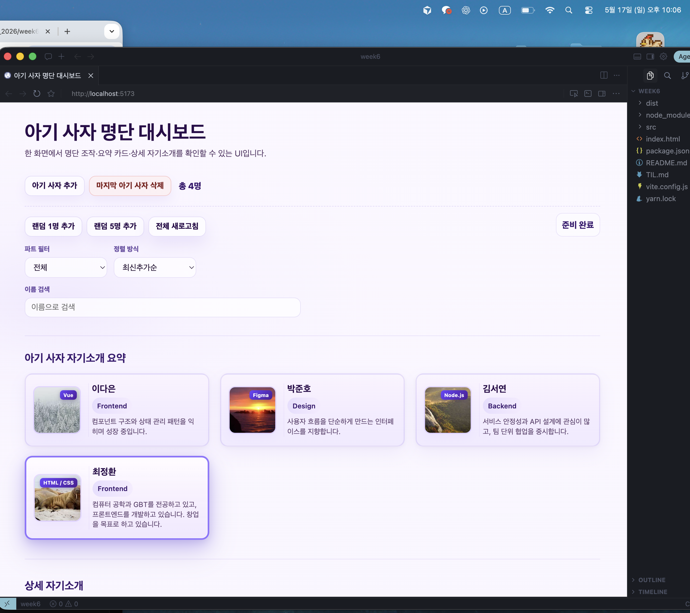
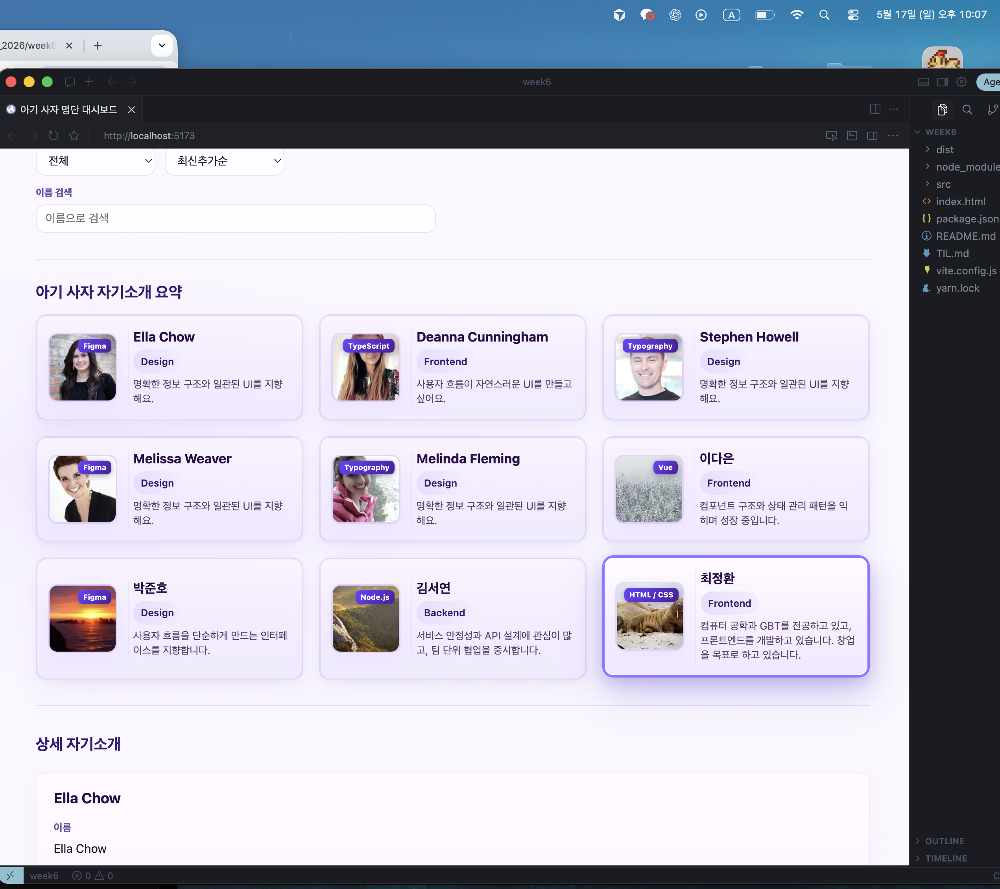
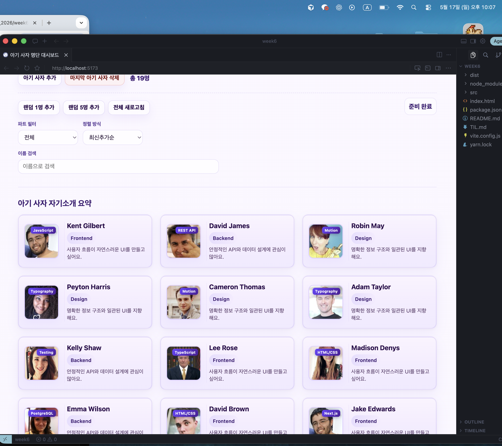
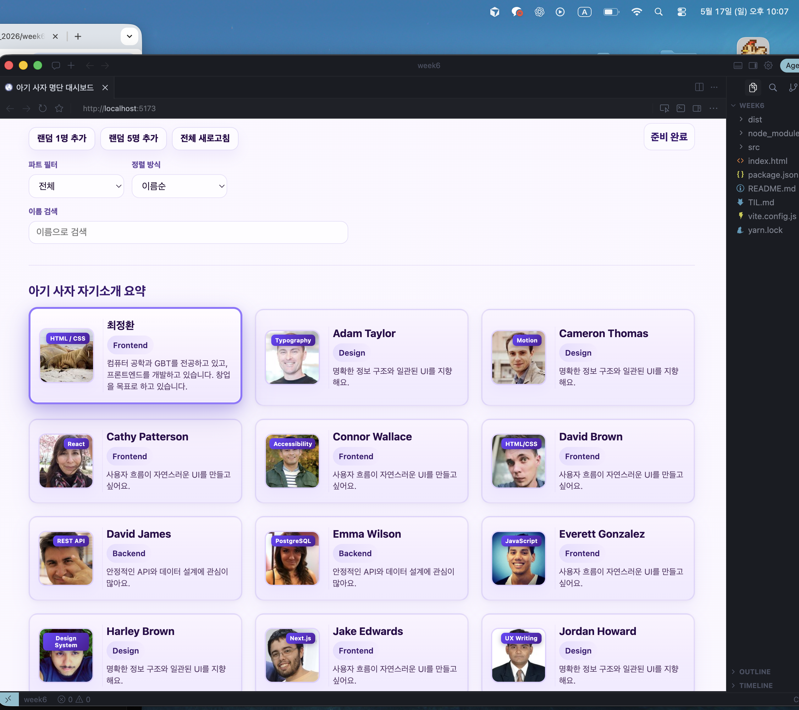
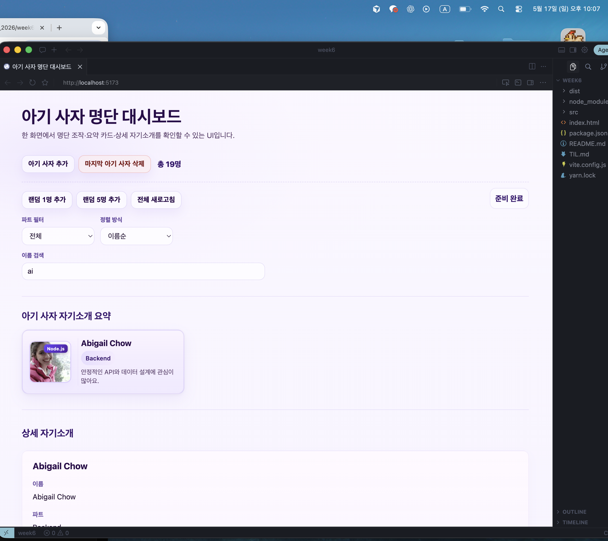
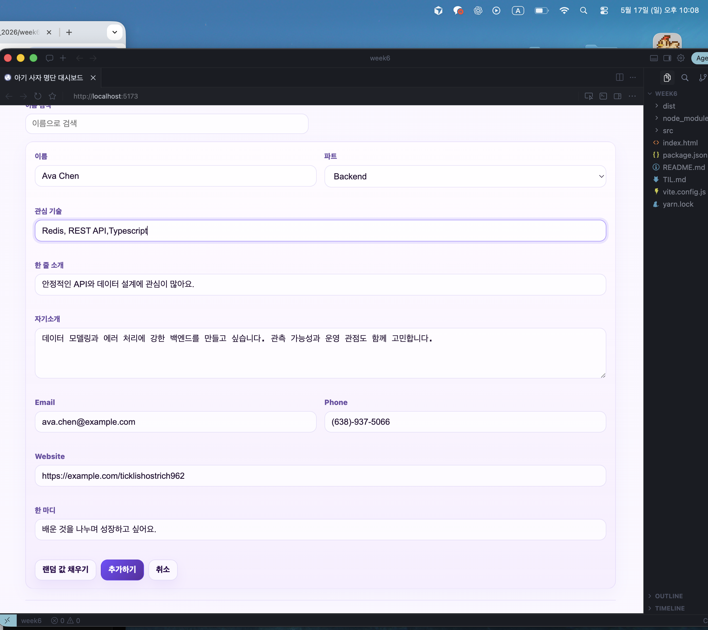

# Today I Learned

### 1. 오늘 배운 내용

DOM 직접 조작 vs 상태 기반 UI

4주차에서는 createElement, innerHTML, append로 카드를 직접 만들고 붙였다. 6주차 React에서는 lions 배열만 바꾸고 화면은 JSX가 그린다.

DOM을 직접 조작할 때는 어떤 요소를 만들고 어디에 붙이고 언제 지울지를 신경 썼다. 상태 기반 UI에서는 lions 배열이 어떻게 바뀌어야 하는지만 생각하면 된다.

화면 구조를 JSX에 한 번 적어두면 데이터만 바꿔도 요약 카드, 상세 카드, 총 인원이 같이 갱신된다. 기능이 늘어날수록 DOM 위치를 맞추는 것보다 상태를 맞추는 쪽이 관리하기 쉬웠다.

useEffect가 필요한 이유

useState는 지금 화면에 무엇을 보여줄지 다루고, useEffect는 렌더링과 따로 실행해야 하는 작업을 다룬다.

ESC로 폼을 닫을 때 useAddForm에서 폼이 열려 있을 때만 document에 keydown 리스너를 등록하고, 닫히면 해제했다.

API 요청은 버튼 클릭 핸들러에서 처리했고, 로딩 중 버튼 비활성화와 실패 시 재시도는 useRandomUserFetch에 모았다. 렌더 함수 안에서 매번 API를 호출하면 요청이 반복될 수 있어서, 부수 효과를 언제 실행할지 분리하는 게 중요하다는 걸 알았다.

Custom Hook으로 로직 묶기

App.jsx에 상태와 핸들러를 전부 넣을 수도 있었지만, 역할별로 Hook을 나눴다.

useLions는 명단 추가, 삭제, 전체 교체를 담당한다.
useViewOptions는 필터, 정렬, 검색어를 담당한다.
useRandomUserFetch는 API 요청, 로딩, 실패, 재시도를 담당한다.
useAddForm은 폼 열기/닫기, 입력값, ESC, 랜덤 채우기를 담당한다.

한 파일에 다 넣으면 App이 길어지고 역할이 섞여서 읽기 어렵다. Hook으로 나누니 이름만 봐도 역할이 보이고, App.jsx는 Hook을 조합해 화면에 연결하는 일만 하면 됐다.

### 2. 핵심 정리 (내 언어로)

* DOM을 직접 건드리지 않고 데이터(상태)만 바꿔도 화면이 따라온다.
* API나 키보드 같은 작업은 렌더와 분리하고, Custom Hook으로 묶으면 App이 읽기 쉽다.
* Hook 이름만 봐도 역할이 구분된다.

### 3. 결과 이미지(스크린샷)

1. 2026-05-17 22:06:58 초기 화면 (총 4명)

2. 2026-05-17 22:07:05 랜덤 5명 추가 후

3. 2026-05-17 22:07:20 랜덤 추가 후 (총 19명)

4. 2026-05-17 22:07:33 이름순 정렬

5. 2026-05-17 22:07:55 이름 검색 (ai)

6. 2026-05-17 22:08:43 아기 사자 추가 폼, 랜덤 값 채우기

### 4. 느낀 점

* 5주차는 보여주기에 가까웠다면, 이번 주는 버튼과 API, 폼까지 연결하면서 상태가 곧 화면이라는 걸 체감했다.
* 4주차 DOM 방식과 비교하면 React는 처음에 Hook 구조를 이해하는 데 시간이 들지만, 기능이 늘어날수록 수정 범위가 Hook 단위로 좁혀져서 편했다.
